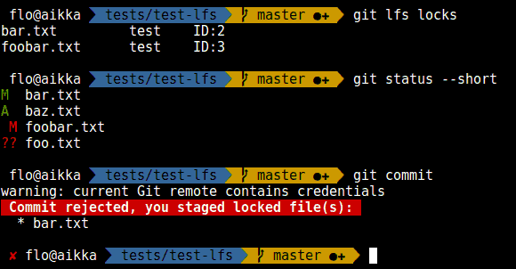

# Git LFS File Locking pre-commit Hook

This pre-commit hook avoid you to commit locked files when you are using the
[File Locking][lfs-lock] functionality of [Git LFS][lfs].

## How To Use

### Linux / BSD / Mac OS X / Windows with Python

Simply copy the `pre-commit` file in the `.git/hooks/` folder of your
target repository:

    cp path/to/git-lfs-lock-pre-commit-hook/pre-commit .git/hooks/

On Unix systems (Linux, Mac OS X,...), be sure to make this script executable:

    chmod +x .git/hooks/pre-commit

That's it.

### Windows without Python

For Windows users that cannot / do not want to install Python, a sand alone
version is available in the `dist\` folder. Simply copy `pre-commit.exe` in the
`.git\hooks\` folder of your Git repository.

## Building The Stand Alone Version

To build the stand alone version, you first need to install [Python][] and then
to install [PyInstaller][]:

    pip install pyinstaller

Finally just build the executable, with GNU make, if available:

    make

or manually, if you do not have GNU make:

    pyinstaller -F pre-commit

[lfs]: https://github.com/git-lfs/git-lfs
[lfs-lock]: https://github.com/git-lfs/git-lfs/blob/master/docs/api/locking.md
[Python]: https://www.python.org/
[PyInstaller]: http://www.pyinstaller.org/
